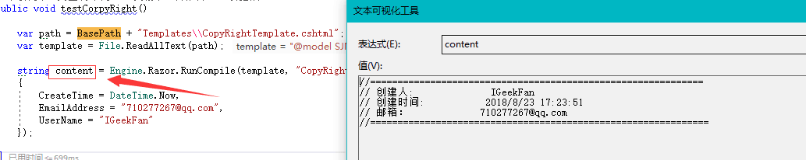

# SJNScaffolding
ABP代码生成器

#### 本项目使用RazorEngine模板引擎技术，对于熟悉razor语法的开发者来说是非常容易的。

### 

 这里提供最简单的一个栗子。

demo1

CopyRightTemplate.cshtml模板代码如下
~~~~
    @model SJNScaffolding.Models.TemplateModels.CopyRightUserInfo
    //=============================================================
    // 创建人:              @Model.UserName
    // 创建时间:           @Model.CreateTime
    // 邮箱：             @Model.EmailAddress
    //==============================================================
~~~~

对应的实体类
~~~
    public class CopyRightUserInfo
    {
        public string UserName { get; set; }
        public string EmailAddress { get; set; }
        public DateTime CreateTime { get; set; }
        public string FileRemark { get; set; }
    }
~~~~

对应的test方法
~~~
        //根据路径。要根据自己实际情况调整
        private const string BasePath = @"..\..\..\SJNScaffolding\";
        [TestMethod]
        public void testCorpyRight()
        {
            var path = BasePath + "Templates\\CopyRightTemplate.cshtml";
            var template = File.ReadAllText(path);

            string content = Engine.Razor.RunCompile(template, "CopyRightTemplate", typeof(CopyRightUserInfo), new CopyRightUserInfo
            {
                CreateTime = DateTime.Now,
                EmailAddress = "710277267@qq.com",
                UserName = "IGeekFan"
            });

        }

~~~

下断点后运行，content变量

解决了模板生成，我们就很容易的写出自己的代码生成器。