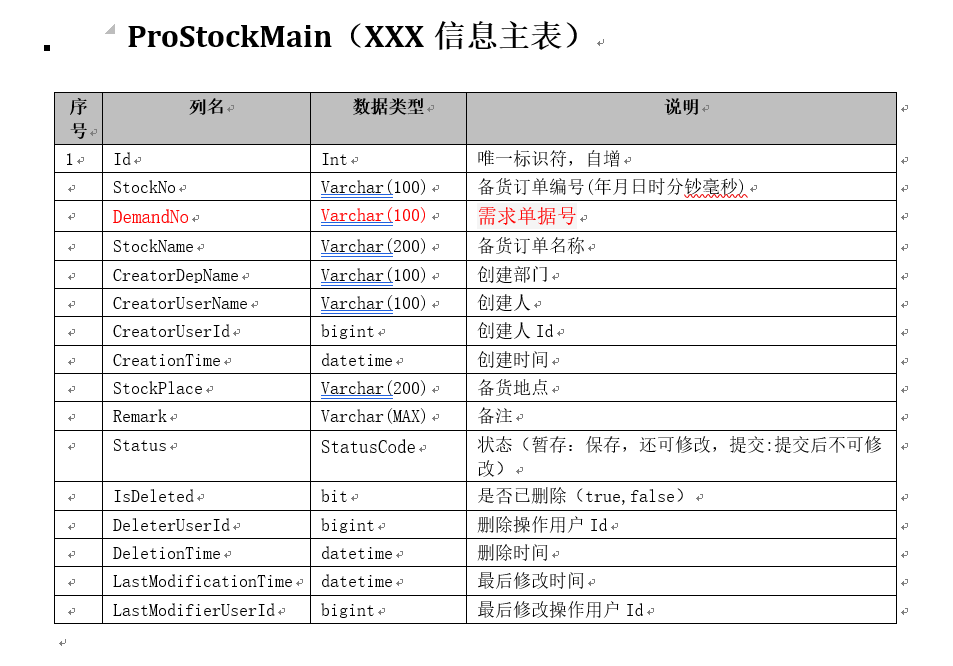
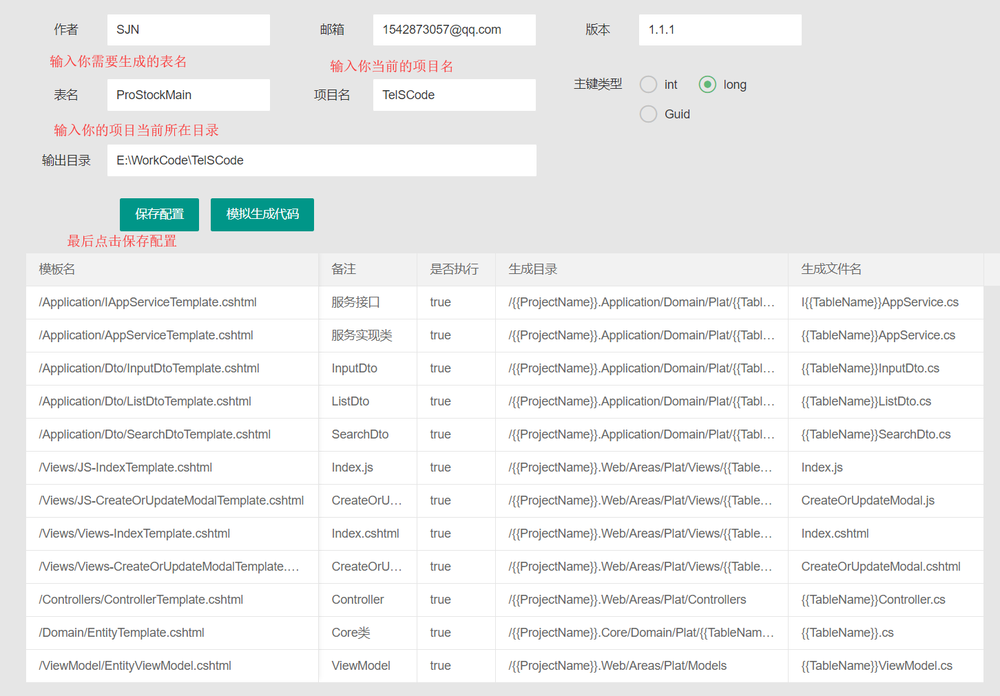
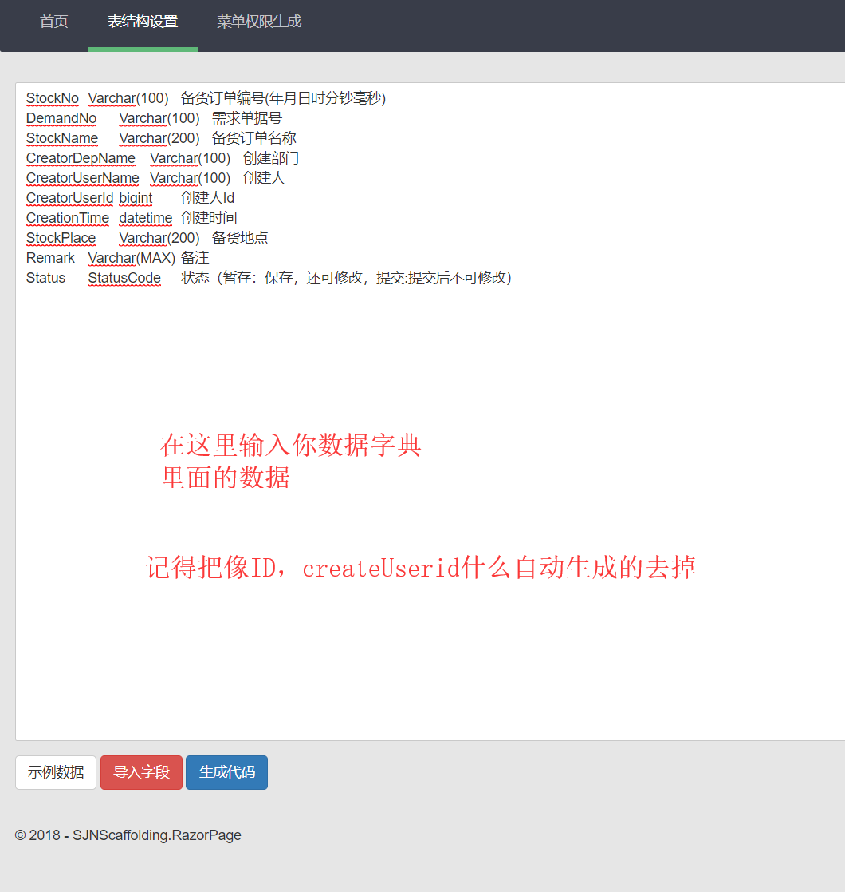
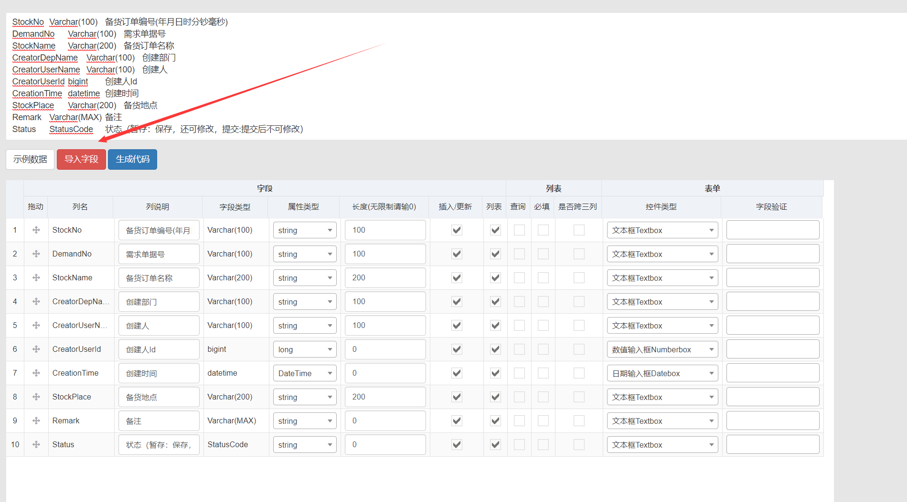
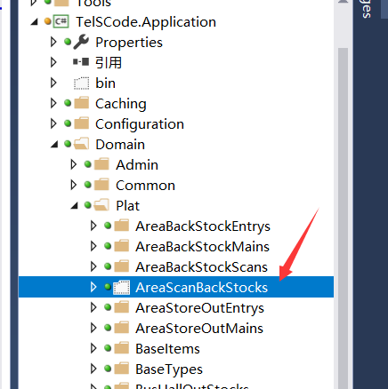

# SJNScaffolding
ABP代码生成器

#### 本项目使用RazorEngine模板引擎技术，对于熟悉razor语法的开发者来说是非常容易的。
#### 以上内容为.NET Framework版本的Razor，该项目已升级至.NET Core2.2 版本，旧版本已移除。不过新版本的Razor生成方式和语法都相差不大。
#### *旧版本使用WPF进行开发，对应的项目名为：SJNScaffolding.WPF，已弃用*

#### 接下来为代码生成器计划:
- 1、中文转英文字段，自动起名字，主要关键字段转换。
- 2、主分表代码生成
- 3、下拉代码自动生成，勾选
- 4、代码生成器部署到某一服务器中，生成后可下载生成后的代码，复制至项目中即可。
    - 文档：[docs/部署至linux.md](docs/部署至linux.md)
    - 项目部署地址 :[http://47.106.80.39](http://47.106.80.39)、[http://www.dotnetcore.xin/](http://www.dotnetcore.xin/)

CodeLF帮程序员起变量名的网站:[https://unbug.github.io/codelf/](https://unbug.github.io/codelf/)

----------
### 这里主要介绍的是SJNScaffolding.RazorPage新项目的使用，RazorEngine模板引擎开发的技术，对于熟悉razor语法的开发者来说是非常容易的。

> #首先你需要像这样格式的一个数据字典

  

> #运行程序，然后首先来到配置界面，这里可以配置你要生成的表名，以及项目名称等，配置完成之后点击**保存配置**

  

> #表结构设置：在这里将你需要生成的字段从数据字典里面复制进来如图：
  注意：ID，IsDeleted，DeleterUserId，DeletionTime等字段是ABP自动生成的字段这里不必复制进来

  

> #字段复制进来后点击导入字段，生成如下图列表，自行确定每个字段是否需要后点击*生成代码*

  

> #代码生成之后会在对应的目录下面生成对应的文件，只需要手动添加到项目中即可使用（这里还有待改进）

  
